# CricketIQ

> Ball-by-ball T20 win probability, a live match-replay engine, and a verified LLM analyst that will not state a number it did not compute.

<p align="center">
  <a href="#demo">Demo</a> •
  <a href="#system-architecture">Architecture</a> •
  <a href="#installation">Installation</a> •
  <a href="#api">API</a> •
  <a href="#roadmap">Roadmap</a>
</p>

<p align="center">
  <a href="https://anurag9557.github.io/cricket-iq/"></a>
  <a href="https://drive.google.com/file/d/1tkpoCvl6RSYmGW4jW2fXtrhOq2COaosV/view"></a>
</p>

<p align="center">
  
  
  
  
  
  
</p>

<p align="center">
  <a href="https://anurag9557.github.io/cricket-iq/">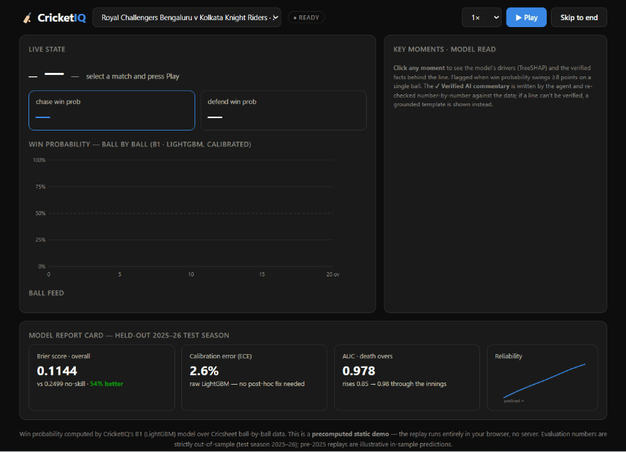</a>
</p>

---

## Project overview

Most cricket interfaces show you *what* happened: the score, the run rate, the fall of wickets. CricketIQ is built to show you *how much it mattered and why*. It scores every second-innings delivery for the chasing side's probability of winning, replays a completed match one ball at a time so you can watch that probability move, flags the deliveries that swung it, and — for those key moments — shows a short, verified broadcast line explaining the swing.

The problem it addresses is narrower and more interesting than "cricket dashboard." Language models are fluent and confident, which makes them dangerous for anything numeric: a model asked "how did the chase turn?" will happily produce a plausible win-probability figure that no model ever computed. CricketIQ treats that failure mode as the central engineering constraint. The result is a system where the fluent, generative part (an LLM) is fenced off from arithmetic entirely, and a deterministic verifier stands between what the model writes and what the user reads.

What makes it different from a score viewer:

- **It quantifies momentum.** A win-probability curve turns "they were under pressure" into "the chase fell from 61% to 41% on that wicket."
- **It explains itself.** Every probability the model outputs can be decomposed into the features that drove it (required run rate, wickets in hand, and so on) via exact tree attributions.
- **It refuses to fabricate.** The commentary and the analyst agent will output a deterministic, grounded fallback before they will output an unverified number.

---

## Project statistics

| Metric | Value |
|---|---|
| Completed men's T20 matches | ~6,977 |
| Deliveries parsed | 1,670,174 |
| Second-innings ball states | 782,542 |
| Competitions | 6 — IPL, T20I, BBL, Blast, PSL, CPL |
| Model features | 11 leak-free chase-state features |
| Held-out test deliveries | 145,985 (2025–26 season) |
| Shipped model | LightGBM — Brier 0.114, AUC 0.92, calibration error 2.6% |
| API endpoints | 8 |
| Verified commentary cards (demo set) | 90 across 9 matches |
| Ungrounded-statistic rate (agent, verification off → on) | 33% → 0% |

---

## Features

**Replay engine.** Streams a completed match back one delivery at a time over Server-Sent Events, driving a live win-probability chart, scoreboard, and ball feed. Playback speed is adjustable, and "skip to end" renders the full curve immediately.

**Win probability.** A calibrated model scores the chasing side's win probability as of every ball, precomputed for every match so the serving path never runs live inference.

**Key-moment detection.** Any delivery that moves win probability by at least eight percentage points is flagged as a key moment and marked on the chart and feed.

**Verified AI commentary.** For the biggest swings in a match, a language model writes one broadcast line per moment. Every number in that line is checked against the underlying facts before the card is stored. Cards that pass are labelled `verified`; if a line cannot be verified after repair, a deterministic template is shown instead and labelled `safe fallback`.

**Explainability.** Clicking any key moment opens an evidence panel: the grounded facts behind the line, plus a per-feature attribution (exact TreeSHAP values) showing which parts of the game state pushed the probability up or down.

**Verified analyst agent.** A separate question-answering agent turns natural-language questions ("how does this batter score at the death?") into deterministic tool calls, then verifies its own answer, re-grounding or refusing any number that does not trace to a tool.

**Match exploration.** A match picker lists every replayable match with teams, date, and venue.

**Analytics and evaluation.** The model ladder, calibration study, per-phase breakdown, and feature ablations are all reproducible and documented, including a deliberately-run deep-learning control.

---

## Engineering highlights

- **Temporal train / validation / test split by match**, not by ball — no future information crosses the split boundary.
- **Per-feature leakage audit.** Venue effects, for example, are computed only from pre-cutoff data.
- **Exact TreeSHAP attributions** from the shipped model — explainability is the model's own contribution values, not a separate approximate explainer.
- **Verification-first LLM pipeline.** Every generated number is checked against source facts before it is shown.
- **Deterministic grounded fallback.** An unverifiable line is replaced by a template built from verified figures — never dropped, never faked.
- **Offline commentary generation.** The language model never sits on the request path.
- **Server-Sent-Events replay** over plain HTTP — the right primitive for a one-directional stream.
- **An honest negative result.** A GRU sequence model that tied the tree model is reported, not hidden.

---

## Demo

**Live demo:** **<https://anurag9557.github.io/cricket-iq/>** — a precomputed, server-free replay that runs entirely in your browser on GitHub Pages (no backend to wake, nothing to fail live). Pick a match, press **Play** (or **Skip to end**), and click any key moment for the verified commentary and the model's SHAP drivers.

**Video walkthrough:** a ~1-minute narrated tour of the replay, the verified commentary, and the explainability panel — **[watch on Google Drive](https://drive.google.com/file/d/1tkpoCvl6RSYmGW4jW2fXtrhOq2COaosV/view)**.

The replay shown in the header is the 2024 RCB vs KKR match — a chase settled by a single run — with verified commentary cards firing on each key moment.

---

## System architecture

The system is a pipeline. Raw match data is parsed into columnar tables, a model scores every ball, the scored timelines drive both an offline commentary generator and the live serving layer, and a single-page interface consumes it all. Nothing expensive happens in the request path — every heavy computation (model scoring, commentary generation, verification) is done ahead of time and written to disk.

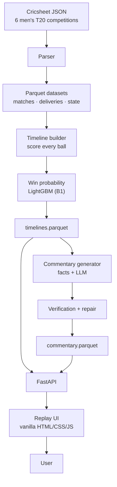

The guiding principle is *precompute, then serve reads*. Win probabilities are scored offline into `timelines.parquet`; commentary is generated and verified offline into `commentary.parquet`. The API only ever reads these files, which means a live demo cannot fail on a slow model call or a flaky network hop to an LLM.

### The journey of one ball

The clearest way to understand the system is to follow a single delivery from raw data to the screen. A ball is parsed, turned into chase-state features, scored, and appended to the timeline. If its win-probability swing crosses the key-moment threshold, it also flows through the offline commentary path — narrated, verified, and stored — so that by the time the replay reaches it, both the number and its explanation are waiting.

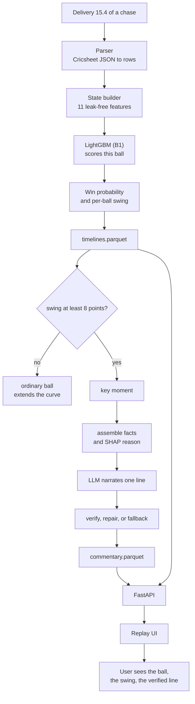

---

## Detailed pipeline

Each subsystem is described on its own below so it can be understood independently.

### 1. Data pipeline

Raw Cricsheet JSON is parsed into two normalized tables, then reshaped into a per-ball chase-state table that every downstream model and view is built on. Player names are stored as registry IDs, not strings, so that name ambiguity is resolved once rather than everywhere.

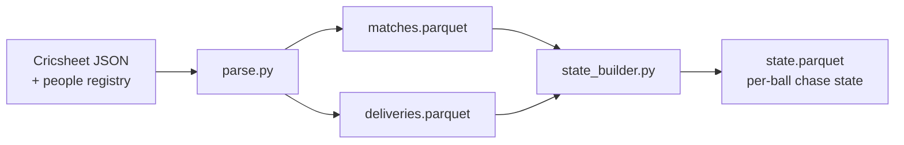

`matches.parquet` holds one row per match (teams, venue, toss, outcome, target). `deliveries.parquet` holds one row per delivery. `state.parquet` holds one row per second-innings delivery with the leak-free features a model may use *as of that ball* — score, wickets in hand, balls remaining, runs needed, required run rate, the gap to the required rate, and short-window momentum. Rain-shortened (DLS) and super-over matches are excluded and counted, not silently dropped.

### 2. Timeline pipeline

The trained model is run over every second-innings delivery to produce a scored timeline per match. This is the artifact the replay reads from; it is computed once and never recomputed at request time.

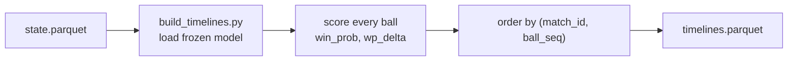

Each row carries the win probability, the change in win probability from the previous ball (`wp_delta`), and the raw event (runs this ball, whether a wicket fell). The key-moment flag is derived from `wp_delta` at read time.

### 3. Win-probability pipeline

Per-ball state features go into a gradient-boosted model that outputs the chasing side's win probability. A calibration study was run and its conclusion was to apply *no* post-hoc calibration — the raw model is already well-calibrated on held-out data, and both isotonic and Platt scaling made it worse. A sequence model (GRU) was trained as a control and tied the tree model; it is documented, not shipped.

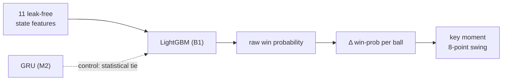

The calibration study is a deliberate step, not an omission: post-hoc calibration was fit, evaluated on the held-out season, found to hurt, and rejected. The model is shipped raw.

### 4. Commentary pipeline (offline)

For the largest swings in each match, a fact set is assembled deterministically, a language model narrates one line from it, and the line is verified before storage. The model is never asked to compute or infer a number, and never asked to reason about cause — the causal phrase is derived from the model's own feature attribution and handed to it ready-made.

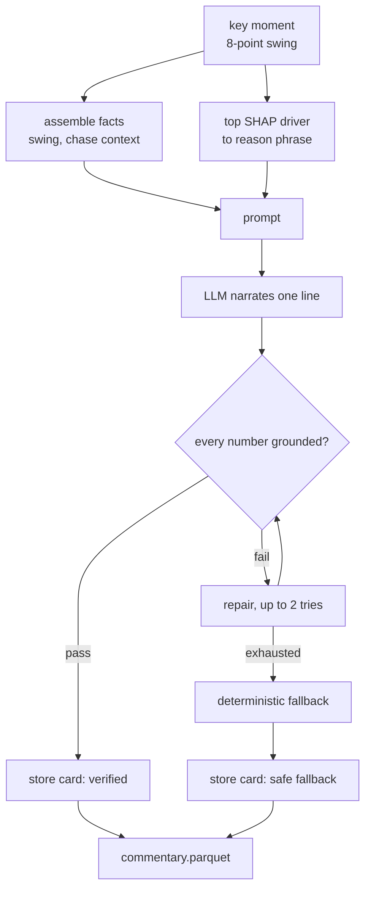

### 5. Replay flow (online)

At request time the interface fetches the match's commentary once, then opens a streaming connection that replays the match ball by ball. Commentary is matched to deliveries by sequence number as they arrive.

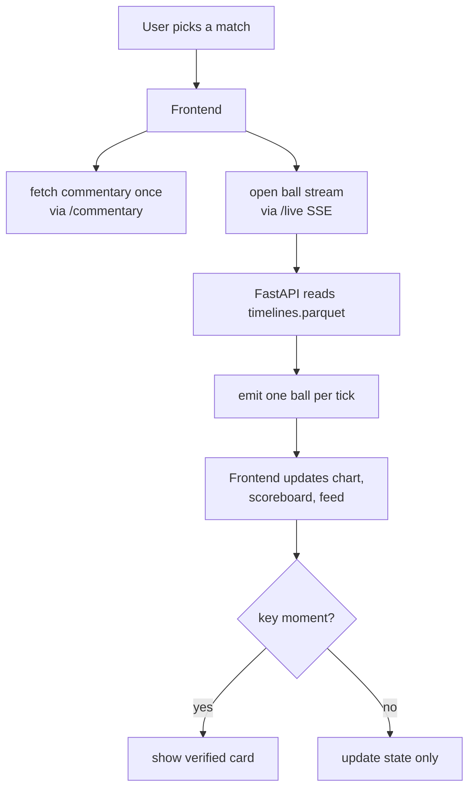

### 6. Verification pipeline

Verification is a membership check, not a language-model judgment. Every number in a generated line is extracted and confirmed to appear in the fact set the line was built from. Anything that does not is treated as ungrounded.

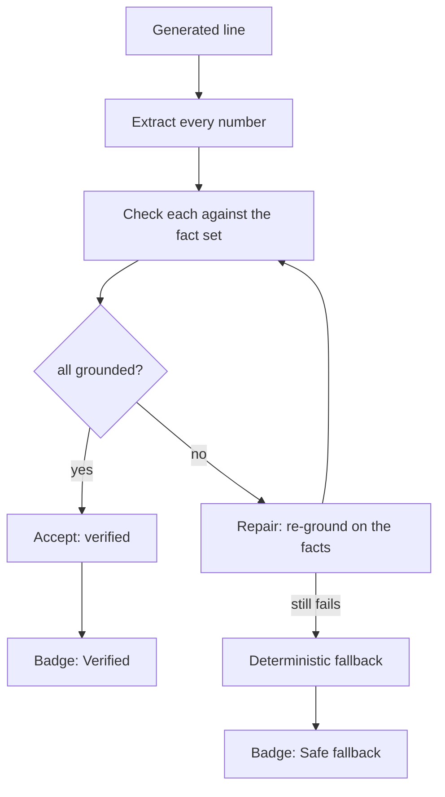

---

## Repository layout

The codebase is organized by responsibility, not by file type, so that each stage of the pipeline lives in one place.

```text
src/cricketiq/
├── data/     download, parse, per-ball state builder
├── models/   B0 logistic · B1 LightGBM (shipped) · calibration · M2 GRU (control)
├── eval/     temporal split · metrics · ablations
├── serve/    FastAPI · data access · TreeSHAP · timeline & commentary builders · replay UI
├── agent/    stat tools · verifier · repair · LangGraph · audits
└── core/     shared configuration
tests/          parser · state · eval · tools · verifier
documentation/  results · leakage audit · serving · verified-agent notes
```

`src/cricketiq/data/` — ingestion and preparation. The download, parse, and state-building scripts that turn Cricsheet JSON into the columnar tables everything else reads. This is where the leak-free feature definitions live.

`src/cricketiq/models/` — the predictive models. The logistic baseline (B0), the shipped gradient-boosted model (B1), the calibration study, and the sequence-model control (M2). This folder produces the frozen model artifact the serving layer loads.

`src/cricketiq/eval/` — the evaluation harness. The temporal train/validation/test split, the metrics (Brier, log-loss, AUC, calibration error), and the feature ablations. Kept separate from the models so that scoring is defined once and reused.

`src/cricketiq/serve/` — the serving layer and the offline builders that feed it. The FastAPI application, the data-access layer that reads the Parquet artifacts, the TreeSHAP explainer, the timeline builder, the commentary generator, and the single-page replay interface (`static/index.html`).

`src/cricketiq/agent/` — the verified analyst agent. The deterministic stat tools, the win-probability tools, the tool-calling loop, the verifier, the repair loop, the LangGraph state machine, and the audit harnesses.

`src/cricketiq/core/` — shared configuration (paths, constants, phase definitions) imported across the other packages.

`tests/` — parser invariants, state-builder cross-checks, evaluation-harness sanity checks, stat-tool golden values, and verifier tests.

`documentation/` — the results write-up (the model ladder and all metrics), the leakage audit, the serving notes, and the verified-agent write-up.

---

## End-to-end flow

The full lifecycle of a replay, from opening the page to inspecting why a probability moved:

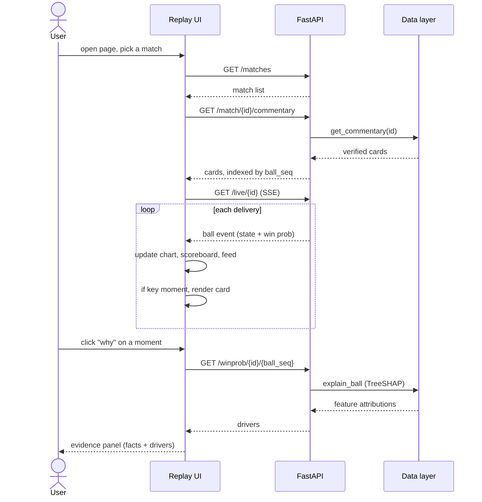

---

## Design decisions

**Parquet over a database.** The workload is read-heavy, append-rarely, and columnar (score a whole column of deliveries, read a whole match's timeline). Parquet gives compression and fast columnar reads with zero operational overhead — no server to run, no schema migrations, no connection pool. A relational database would add moving parts to a system whose data is effectively immutable once built.

**Polars over pandas.** The pipeline does large group-bys and joins over roughly 1.7 million deliveries. Polars' lazy, multi-threaded execution handles this comfortably and keeps the feature-engineering code expression-based rather than index-fiddling. The serving layer never touches Polars directly — it goes through a thin data-access module, so the storage engine stays an implementation detail.

**FastAPI with Server-Sent Events.** The replay is a one-directional stream: the server pushes a ball, the client renders it. SSE is the right primitive for that — simpler than WebSockets, works over plain HTTP, reconnects natively, and needs no bidirectional channel. FastAPI provides typed request/response schemas and an async streaming response with minimal ceremony.

**LightGBM as the shipped model.** It matches the sequence model on accuracy, is better calibrated, needs no GPU, trains in seconds, and — decisively — supports exact TreeSHAP attributions. The explainability panel is not a bolt-on; it is the same model's exact contribution values. A neural network would have forced approximate attributions for no measured accuracy gain.

**Precomputed commentary over live LLM calls.** Generating and verifying a broadcast line involves an LLM call, a verification pass, and up to two repair rounds. Doing that in the request path would make the demo slow and fragile, and would put an external API on the critical path of a portfolio piece that needs to work on a stranger's laptop. Precomputing to `commentary.parquet` makes serving a file read that cannot fail live, and makes every card auditable before anyone sees it.

**A verification layer instead of prompt-engineering.** Asking a model nicely not to hallucinate is not a guarantee. Extracting every number from its output and checking membership against the source facts is. The verifier is deterministic, so its guarantee does not depend on the model's mood, temperature, or version.

**A static, framework-free frontend.** The interface is a single hand-written HTML file with inline CSS and vanilla JavaScript, including a hand-drawn SVG chart. This keeps the showpiece fully controllable and dependency-free — no build step, no framework churn, and the entire UI is legible in one file for anyone reviewing the code.

**Confidence expressed as a grounding verdict, not a percentage.** A stated number either traces to the data or it does not; there is no useful "80% confident" in between. CricketIQ therefore labels commentary with a binary status (`verified` / `safe fallback`) rather than a fabricated confidence figure. Where genuine uncertainty exists — a stat computed from a handful of balls — it is surfaced as the sample size `n`, and the win probability itself is a calibrated probability, so its confidence is already in the number.

**Engineered state features over raw ball sequences.** The state builder encodes the trajectory of a chase (required rate, rate gap, rolling momentum) into features, so the model sees the situation directly rather than having to learn it from an ordered sequence. The GRU control confirmed this was the right call: given the same features, sequence memory added nothing.

---

## AI commentary architecture

Commentary is split cleanly into an offline generation stage and an online serving stage. This separation is the whole reason it is reliable.

**Offline generation.** For each match, the generator selects the top key moments by swing magnitude (bounded, to cap cost). For each moment it does three things before any model call:

1. **Assemble the facts.** The numbers the line is allowed to mention — the win probability, the swing in points, runs needed, balls remaining, the score — are pulled from the timeline and chase state. This dictionary is the single source of truth for the line.
2. **Derive the reason.** The model's top feature attribution for that ball is mapped, deterministically, to a plain-English phrase (for example, a dominant required-run-rate contribution becomes "with the asking rate climbing"). The language model is never asked to infer *why* the probability moved — it is handed the reason. This eliminated an entire class of backwards-causality errors.
3. **Guard the reason.** If the derived reason's direction disagrees with the ball's net swing (a wicket falling while the required rate happened to ease), the reason is dropped rather than paired with a contradicting cause.

Only then is the model asked to write one line, weaving in the facts and the ready-made reason. The line is verified; on failure it is repaired up to twice; if it still fails, a deterministic template built from the same facts is used instead. Every card is written to `commentary.parquet` with its status.

**Online serving.** At request time none of the above happens. The interface fetches the precomputed cards for a match once and indexes them by delivery sequence number. As the replay streams, a card is shown the instant its delivery arrives. The evidence panel folds the stored facts together with a live, on-demand feature attribution for that ball.

The distinction matters: **generation is where cost, latency, and fallibility live; serving is a lookup.** A viewer can never trigger an LLM call, and can never be shown a number that was not verified before the card was stored.

---

## Replay engine

The replay turns a static scored timeline into a live-feeling broadcast.

**Timeline.** The source of truth is `timelines.parquet` — every delivery of a match, in order, with win probability and per-ball swing already computed. The engine never scores anything; it reads.

**Playback.** A streaming endpoint emits one ball per tick over SSE. The tick interval is set by a speed control (from half to four times real cadence). Each event carries the full state for that ball — score, wickets, balls remaining, required rate, win probability, and the swing.

**Seeking.** "Skip to end" bypasses the stream, fetches the whole timeline in one request, and renders the complete curve immediately, ending in the match's final state.

**Synchronization.** Commentary is fetched once up front and held in an in-memory map keyed by delivery sequence number. Because both the streamed ball events and the commentary cards carry the same sequence number, matching a card to its delivery is a constant-time lookup with no coordination between the two data sources.

**Probability updates.** Each ball extends the win-probability curve, updates the two win-probability tiles (chasing side and defending side), and, for a key moment, drops a marker on the chart.

**Commentary updates.** When a streamed delivery is a key moment and a card exists for it, the verified line and its status badge are rendered. If no card exists (a smaller key moment, or a match with no generated commentary), a deterministic templated line is shown instead, so the panel is never empty and never unverified.

**State updates.** The scoreboard, ball feed, and required-rate line update on every delivery, key moment or not.

---

## Win probability

The model answers one question for every second-innings delivery: what is the probability that the chasing side goes on to win?

**Input features.** Eleven leak-free features describing the chase as of that ball: wickets in hand, balls remaining, runs needed, required run rate, the gap between current and required rate, the target, short-window (last-30-ball) run and wicket momentum, and phase context. Every feature is computable from information available at that moment — venue effects, for instance, are derived only from pre-cutoff data, so nothing from the future leaks in.

**Model.** A gradient-boosted decision-tree model (LightGBM) trained on a temporal split — earlier seasons to train, one season to validate, the most recent season held out for test. The required-rate features carry most of the signal, which matches cricketing intuition: a chase is mostly a question of whether you are ahead of or behind the rate, with wickets in hand as the constraint.

**The sequence-model control.** A causal GRU was trained on the identical features as a deliberate check on whether recurrent memory over ball order would help. It tied the tree model to within sampling noise and was slightly worse calibrated. The interpretation — that the engineered state already encodes the trajectory, so sequential memory adds nothing — is reported as an honest negative result rather than hidden.

**Calibration.** The raw model is already well-calibrated on the held-out season. A calibration study fit isotonic and Platt scaling on the validation season and found that both made held-out calibration *worse* — the validation season's miscalibration did not transfer. The decision was to ship the raw model with no post-hoc calibration, and to document why.

**Key moments (the "excitement" signal).** There is no separate excitement model. A delivery is a key moment when it moves win probability by at least eight percentage points. This single threshold drives the chart markers, the ball-feed highlighting, and the selection of which moments get generated commentary.

**Interpretability.** Because the model is a decision-tree ensemble, its output for any ball can be decomposed exactly via TreeSHAP into per-feature contributions in log-odds. The "why" panel renders these directly: green bars are features pushing the chasing side's probability up, red bars down. These are exact attributions from the same model, not a separate approximate explainer.

---

## Verification layer

Verification is the component that lets the rest of the system use a language model at all.

**What it checks.** Given a piece of generated text and the set of facts it was built from, the verifier extracts every number in the text and confirms each one appears in the facts, within a small rounding tolerance. Signed values (a negative swing narrated as a magnitude) are matched on magnitude; structural numbers (phase boundaries like "16–20", thresholds) are whitelisted; nested facts (a list of moments) are walked recursively.

**Supported vs ungrounded claims.** A number that traces to the facts is supported. A number that does not — a difference the model computed, a percentage it inferred, a value it simply invented — is ungrounded, and the text is rejected.

**Rejection and repair.** A rejected line is not shown. In the commentary generator and the analyst agent alike, an ungrounded answer triggers a repair loop that re-grounds the response on the verifier's finding. If repair is exhausted, a deterministic response built only from verified figures is used instead. No ungrounded number ever reaches the user.

**The verdict, not a confidence number.** Verification produces a binary outcome — grounded or not. The commentary badge reflects it directly: `verified` when the model's own line passed, `safe fallback` when the deterministic template was used. This is deliberately not a probabilistic confidence; provenance is not fuzzy.

**Why it matters.** On a mixed benchmark, running the analyst agent with verification off versus on took the rate of answers containing an ungrounded statistic from 33% to 0% — repair re-grounded most, and the safe fallback caught the rest. The zero is not a lucky run: it holds by construction, because a number is either shown with a source or not shown at all. A crucial honesty note travels with this: the verifier guarantees *numeric provenance*, not the truth of the surrounding reasoning — it proves every number came from the data, not that a qualitative claim built around those numbers is correct.

---

## Performance

The architecture's performance story is mostly about what is *not* on the request path. Win probabilities and commentary are precomputed; serving them is a file read and an in-memory lookup. The only on-demand computation is a single-row TreeSHAP call when a user clicks "why."

| Aspect | Characteristic |
|---|---|
| Win-probability serving | Precomputed; no live model inference — read from `timelines.parquet` |
| Commentary lookup | In-memory map keyed by delivery sequence, O(1) per ball |
| "Why" attribution | Single-row native TreeSHAP, computed on demand |
| Replay cadence | One ball per tick, 0.5×–4× speeds (configurable) |
| `state.parquet` | Per-ball chase state — 782,542 rows |
| `commentary.parquet` (demo set) | Verified cards — 90 across 9 matches |

---

## Technologies

| Layer | Choice |
|---|---|
| Language | Python 3.14 |
| Data engine | Polars, Apache Parquet (PyArrow) |
| ML — shipped | LightGBM (win-probability model), scikit-learn (baseline, calibration study) |
| ML — control | PyTorch (GRU sequence model) |
| Explainability | Native LightGBM TreeSHAP (no `shap` dependency) |
| Agent | OpenAI tool-calling, LangGraph state machine |
| Serving | FastAPI, Server-Sent Events, Uvicorn |
| Frontend | Vanilla HTML, CSS, JavaScript; hand-drawn SVG chart |
| Testing | pytest |

---

## Installation

Requires Python 3.11 or newer (developed on 3.14).

```bash
git clone https://github.com/Anurag9557/cricket-iq
cd cricket-iq

python -m venv .venv
# Windows:
.venv\Scripts\activate
# macOS / Linux:
source .venv/bin/activate

pip install -r requirements.txt
```

The analyst agent and commentary generator need an OpenAI API key, read from a gitignored `.env` file:

```
OPENAI_API_KEY=sk-...
```

The replay UI and the predictive models do **not** need a key — only the LLM-facing components do.

---

## Running

The pipeline builds its own data artifacts; run the stages in order the first time.

```bash
# 1. Data: download, parse, and build per-ball chase state
python -m cricketiq.data.download          # Cricsheet JSON + player registry
python -m cricketiq.data.parse             # -> matches.parquet, deliveries.parquet
python -m cricketiq.data.state_builder     # -> state.parquet

# 2. Model: train the shipped win-probability model
python -m cricketiq.models.gbm             # -> b1.pkl

# 3. Timelines: score every ball for every match
python -m cricketiq.serve.build_timelines  # -> timelines.parquet

# 4. Serve the replay UI
uvicorn cricketiq.serve.api:app            # http://127.0.0.1:8000
```

To exercise the analyst agent and the evaluation harness:

```bash
python -m cricketiq.agent.agent "How does Virat Kohli score in the death overs?"
python -m cricketiq.agent.offon            # verification OFF vs ON headline
pytest                                     # parser, state, eval, tools, verifier
```

> Module names above follow the `src/cricketiq/` layout; if any local script differs, adjust the command accordingly.

---

## Building commentary

Commentary is generated offline and written to `commentary.parquet`, which the serving layer reads. It is not committed (it lives under the gitignored `data/`), so it is regenerated from the timelines and the model.

Generate for specific matches:

```bash
python -m cricketiq.serve.build_commentary <match_id> [<match_id> ...]
```

Or build a curated demo set — the helper ranks matches by number of key moments and late-innings drama and generates commentary for the most exciting ones:

```bash
python -m cricketiq.serve.build_ipl_demo            # dry run: print the picks, no API calls
python -m cricketiq.serve.build_ipl_demo --build    # generate commentary for the picks
```

Because the data-access layer caches commentary at load, **restart the server after regenerating** so it reloads the new file. Each generated card records its verification status, so a build reports how many lines were `verified` versus `safe fallback`.

---

## API

All responses are JSON except the streaming endpoint. Match IDs are strings.

**`GET /matches?limit=`** — replayable matches for the picker, newest first.

**`GET /match/{match_id}/timeline`** — the full scored timeline plus match metadata, used to render the whole curve at once.

```json
{
  "meta": { "match_id": "1426274", "team_chase": "Royal Challengers Bengaluru", "team_bat_first": "Kolkata Knight Riders", "target": 223 },
  "balls": [ { "ball_seq": 0, "display_ball": "0.1", "win_prob": 0.41, "wp_delta": 0.0, "is_key_moment": false } ]
}
```

**`GET /match/{match_id}/commentary`** — the precomputed verified cards for a match.

```json
{
  "match_id": "1512844",
  "cards": [
    {
      "ball_seq": 87,
      "over": 15,
      "event_type": "boundary",
      "commentary": "Over 15, that six swings everything their way, putting the chase ahead of the rate — 72%.",
      "status": "verified",
      "win_prob_pct": 72.0,
      "wp_delta_pts": 26.2,
      "runs_needed": 52,
      "balls_remaining": 35,
      "reason": "putting the chase ahead of the rate"
    }
  ]
}
```

**`GET /winprob/{match_id}/{ball_seq}`** — the model's win probability for one delivery with ranked TreeSHAP drivers (powers the "why" panel).

```json
{
  "match_id": "1512844",
  "ball_seq": 0,
  "win_prob": 0.4156,
  "drivers": [
    { "feature": "required_rr", "label": "required run rate", "value": 10.18, "contribution": -0.8604, "direction": "down" }
  ]
}
```

**`GET /live/{match_id}?interval=`** — Server-Sent Events. Emits one `meta` event, then one `ball` event per delivery every `interval` seconds, then an `end` event.

**`POST /winprob`** — score and explain an arbitrary chase state (the what-if endpoint); the body is the eleven state features.

**`GET /health`** — liveness plus the number of replayable matches.

---

## Screenshots

| Main replay | Win-probability graph |
| :--: | :--: |
| 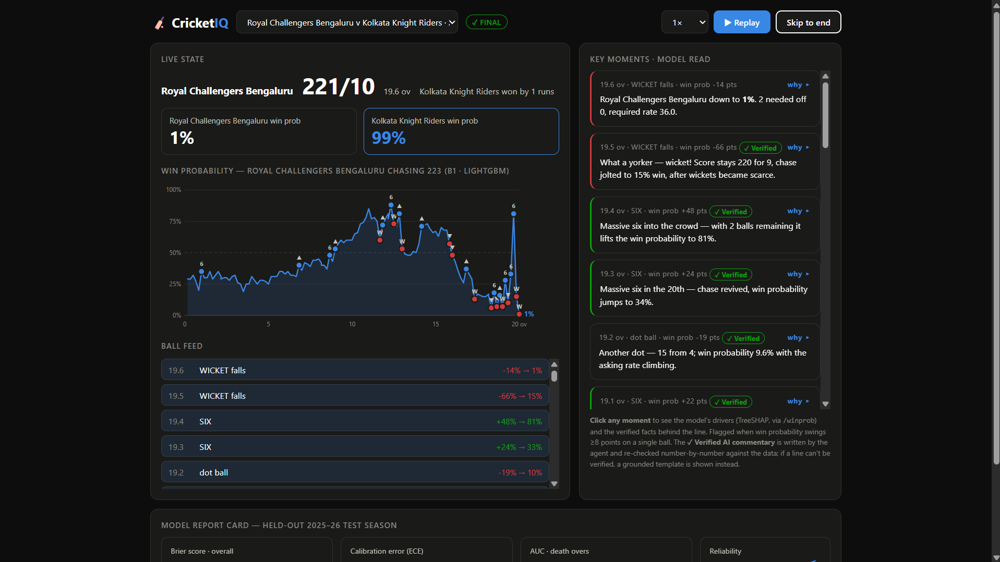 | 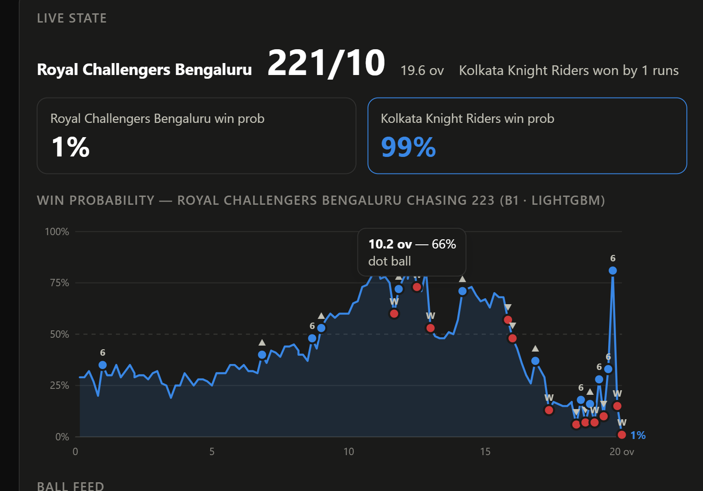 |

| Commentary card + evidence panel | Ball feed / timeline |
| :--: | :--: |
| 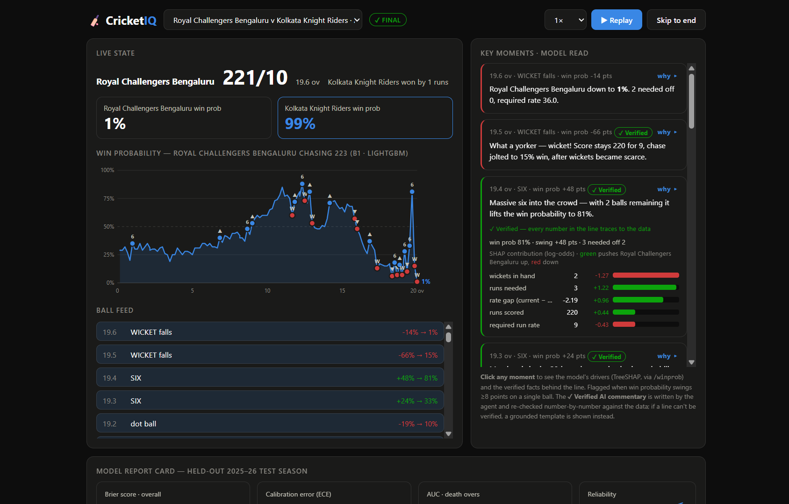 | 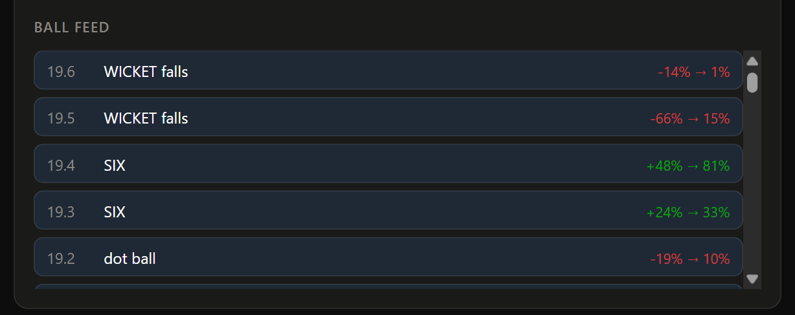 |

---

## Roadmap

**Shipped**

- [x] Calibrated win-probability model with a temporal train/test split
- [x] Ball-by-ball replay engine over Server-Sent Events
- [x] Precomputed verified commentary with a deterministic fallback
- [x] Native TreeSHAP explainability
- [x] Verified analyst agent (ungrounded-statistic rate 33% → 0%)

**Planned**

- [ ] Live-match ingestion and incremental scoring
- [ ] Streaming (online) commentary generation, with the verification layer as the safety net that makes it safe
- [ ] Learned player and venue embeddings, with cold-start handling for rare players
- [ ] Multiple LLM providers and cross-checking
- [ ] Mobile-optimized interface

---

## Acknowledgements

- **[Cricsheet](https://cricsheet.org/)** — ball-by-ball match data for every competition used here.
- **FastAPI** and **Uvicorn** — the serving layer.
- **Polars** and **Apache Parquet** — the data engine and storage format.
- **LightGBM** and **PyTorch** — the predictive and control models.
- **OpenAI** and **LangGraph** — the language model and agent orchestration.

## License

MIT.