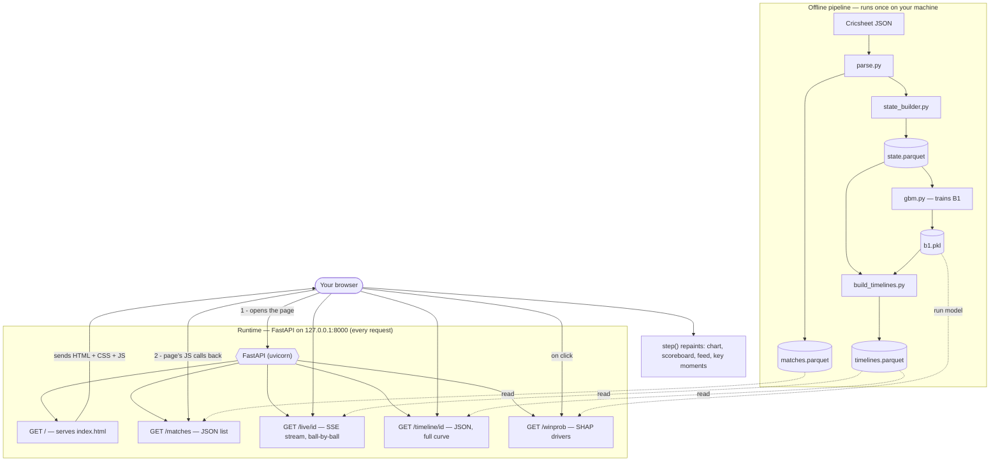

# Serving &amp; UI layer (Phase 4)

How CricketIQ turns a trained model into a live, explainable match-replay web app.
Everything below lives under `src/cricketiq/serve/`.

## Architecture at a glance

The system has two halves. The **offline pipeline** runs once on a machine and
produces three artifacts. The **runtime** is a FastAPI server that only *reads*
those artifacts — no training and (almost) no computation happens per request, so
nothing expensive can fail during a demo.



The design principle throughout is **separation of concerns**: routing, data
access, model serving, and presentation are four different jobs in four files, so
any one can change without touching the others (swap parquet for a database and
only `data.py` changes; retrain the model and only `b1.pkl` changes).

## The files

### `build_timelines.py` — offline: build the replay data

Runs once, not at request time. It loads the frozen `b1.pkl`, scores the win
probability of **every delivery of every match**, and writes
`data/processed/timelines.parquet`. Alongside the probability it precomputes the
fields the UI needs so the frontend never has to calculate anything: `wp_delta`
(the change in win probability from the previous ball — this *is* the key-moment
signal), `runs_this_ball`, and `wicket_fell`. Two asserts guard integrity (no rows
lost, deliveries in order), and it writes with `zstd` compression. Predictions on
pre-2025 matches are in-sample and used only for the illustrative replay; the
evaluation numbers in `docs/results.md` stay strictly out-of-sample.

### `data.py` — the data-access layer

Loads `timelines.parquet` and `matches.parquet` into memory once and answers data
questions. `list_matches()` returns the picker list (newest first, joined to team
names and venue). `get_meta(match_id)` returns one match's static facts.
`get_timeline(match_id)` returns every delivery in order, and this is where two
derived fields are added: a cricket-style `display_ball` label (e.g. `15.3`) built
in plain Python, and `is_key_moment = abs(wp_delta) >= KEY_MOMENT_THRESHOLD`
(0.08 — an 8-point swing). This is the only module that knows about parquet and
polars; the API never touches them.

### `explain.py` — the model / explainability layer

The only module that loads and runs the model. Given a chase state it returns the
win probability plus ranked drivers, computed with LightGBM's built-in TreeSHAP
(`booster_.predict(X, pred_contrib=True)`) — exact per-feature contributions, no
extra `shap` dependency. `explain_features(values)` explains any state;
`explain_ball(match_id, ball_seq)` looks the state up in `state.parquet` first.
Contributions are in log-odds space, so they are reported as ranked directions
(pushing win up / down), not as invented percentages.

### `api.py` — the HTTP routes

The thin doorway. It defines the endpoints, the CORS policy, the SSE streaming
response, and request validation (the Pydantic `MatchState` for the POST body). It
holds no cricket logic and no model — each route receives a request, calls the
right helper in `data.py` or `explain.py`, and returns the result. On startup a
lifespan hook preloads the data so the first request is fast.

### `static/index.html` — the frontend

A single self-contained page (HTML + CSS + vanilla JS) served at `/`. It contains
no data and no model — it fetches everything from the API and renders it. The win
probability chart is hand-drawn SVG (built to the project's data-viz palette, with
light/dark support); there is no charting library.

## The endpoints

| Method | Path | Purpose | Backed by | Reads |
|---|---|---|---|---|
| GET | `/` | Serve the replay page | `api.py` (FileResponse) | `static/index.html` |
| GET | `/health` | Liveness + match count | `data.py` | `timelines.parquet` |
| GET | `/matches?league=&limit=` | Match list for the picker | `data.py.list_matches` | `matches` + `timelines` |
| GET | `/match/{id}/timeline` | Full win-prob curve + metadata | `data.py.get_timeline` / `get_meta` | `timelines` + `matches` |
| GET | `/live/{id}?interval=` | **SSE** replay, one ball per tick | `data.py.get_timeline` | `timelines` + `matches` |
| GET | `/winprob/{id}/{ball_seq}` | Explain a real delivery (SHAP) | `explain.py.explain_ball` | `b1.pkl` + `state.parquet` |
| POST | `/winprob` | Explain an arbitrary state (what-if) | `explain.py.explain_features` | `b1.pkl` |

`/live` is the only streaming endpoint: it opens one long-lived connection and the
server *pushes* Server-Sent Events (`event: meta`, then `event: ball` per delivery
paced by `interval`, then `event: end`). The other three are ordinary
request → response.

## How the frontend works

The mental model: the page is a **renderer**. All intelligence stays server-side;
the browser only paints what it receives.

On load, `boot()` fetches `/matches` to fill the dropdown and draws the empty
chart axes. Pressing **Play** opens an `EventSource` to `/live/{id}`; the browser
registers listeners for `meta`, `ball`, and `end`. The heartbeat is `step(ball)`,
which runs once per delivery: it updates the scoreboard and the two win-prob tiles,
pushes a point onto the SVG line and redraws it, prepends a row to the ball feed,
and — if `is_key_moment` — drops a marker on the chart and a card into the right
panel. Clicking a key-moment card calls `showWhy()`, which fetches
`/winprob/{id}/{ball_seq}` and renders the TreeSHAP drivers as green (up) / red
(down) bars. The `end` event triggers `finish()` (shows the result). "Skip to end"
closes the stream and instead does a single `/timeline` fetch to render the whole
curve at once; the speed selector changes `interval`; `prefers-reduced-motion`
skips the animation.

## A request, end to end

Clicking a key moment:

`index.html` calls `GET /winprob/981005/126` → `api.py` routes it to
`explain.explain_ball(...)` → `explain.py` looks up the feature row in
`state.parquet`, runs `b1.pkl` with TreeSHAP → returns win prob + ranked drivers as
JSON → `api.py` sends it back → `index.html` renders the driver bars. Four files,
four handoffs, one job each.

## Running it locally

```bash
# 1. build the artifacts (once)
python -m cricketiq.models.gbm            # trains B1, saves b1.pkl
python -m cricketiq.serve.build_timelines # writes timelines.parquet

# 2. run the server
uvicorn cricketiq.serve.api:app --reload

# 3. open the app
#    http://127.0.0.1:8000/         (replay UI)
#    http://127.0.0.1:8000/docs     (interactive API docs)
```
