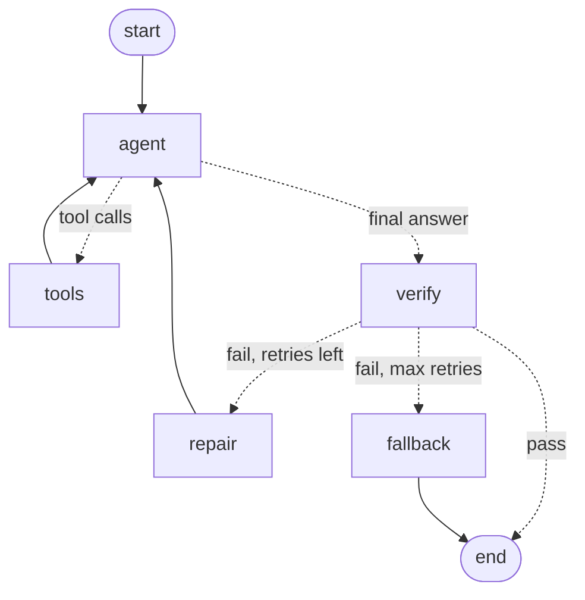

# CricketIQ — The Verified Analyst Agent (Phase 5)

**Claim:** an LLM that answers natural-language T20 cricket questions and is *structurally
unable to state a statistic it did not get from data* — and when it slips, catches and
repairs itself. This document is the evidence.

The headline objection to LLMs in analytics is that they hallucinate numbers with
confidence. CricketIQ answers it with a division of labour: the model *plans and narrates*,
deterministic code *computes*, a verifier *re-checks every number the model wrote*, and a
repair loop *fixes* any number that isn't backed by a tool. The result is measured against
the same model with no tools, on a benchmark whose true answers come straight from the data.

## Architecture

The model never writes a number of its own. It emits tool *calls* (which player, which
phase); the deterministic tools read the data and return the values; the model narrates only
from those returns. The narrated answer is then verified, and repaired if needed.

- **Tools** (`stats.py`) — typed `polars` functions over the ball-by-ball data: batting,
  bowling, matchup, venue par. Each returns the value *and* its sample size `n`. Validated
  against ESPNcricinfo (a known player's totals match).
- **Agent** (`agent.py`) — exposes the tools *by intent*: the model passes player *names*,
  never registry IDs; name→ID resolution and namesake disambiguation are hidden inside.
- **Verifier** (`verify.py`) — pulls every number out of the answer and confirms each traces
  to a tool return. It does *not* re-run the tools (circular); it hunts the opposite
  direction — a number in the prose that no tool produced, which is what a hallucinated or
  hand-computed statistic looks like.
- **Repair** (`repair.py`) — on a verify failure, hands the offending number back with the
  verifier's invariant ("every number must come from a tool") and re-verifies, bounded by a
  retry cap. If repair is exhausted, a deterministic fallback states only the verified
  figures — so an unsupported number can never leave the system.
- **State machine** (`graph.py`) — the plan→verify→repair→fallback flow as a LangGraph graph
  with a real conditional branch and a total, bounded termination.

## The audit: does grounding actually beat the base model?

`golden.py` builds a benchmark of specific split questions (death-over strike rates,
economies, dot %, venue par) whose true answers are computed *live* from the same tools, so
the ruler can never drift from the data. Deliberately rate/ratio stats only: a death-over
strike rate is an intrinsic property a model could in principle know, whereas a cumulative
total depends on our exact data snapshot, so dinging the baseline for missing it would be
unfair.

`audit.py` puts three systems — all built on the **same** model, so grounding is the only
variable — to the benchmark and scores each stated number against the truth into four
outcomes: correct, confidently wrong, clarified (asked which competition), or refused.

| System (same underlying model) | Correct | Confidently wrong | Clarified | Refused | Verified |
|---|---|---|---|---|---|
| **Grounded agent** (tools + verify) | **12/12** | 0 | 0 | 0 | **12/12** |
| Plain LLM, offered an honest out | 2/12 | 0 | 0 | 10 | — |
| Plain LLM, pressed like a real user | 3/12 | 1 | 6 | 2 | — |

The two "correct" for the offered-out arm are the two fake-entity questions it correctly
refused. The pressed arm's fabricate-vs-clarify split is noisy run to run (a second run gave
5 confidently-wrong and 5 clarified), but one result is rock-solid across runs: **the base
model never once produced a correct player-split figure.** Pressed like a real user, it
either invents a number or asks which competition we mean — the exact scope question the
tools settle by design. The grounded agent answers all ten correctly, every number verified.

So the claim isn't the lazy "LLMs hallucinate everything." It's sharper and true: *on precise
T20 splits the ungrounded model can't produce the figure — it guesses or punts — while the
grounded agent answers correctly and provably.*

## Measurement integrity

Twice, an extraction bug in the *grader* nearly reported a number the model never stated.
First the regex pulled `20` out of "T20I" and branded a clarifying question a hallucination;
then it pulled `16` out of "(16-20)" and branded a refusal a fabrication. Both were caught by
refusing to trust the grader's own output and reading the raw model answers. The fix stopped
reading numbers out of prose entirely: **only a response that *leads* with a number counts as
an asserted statistic** — a fabrication looks like "135", a refusal is a sentence. Grading is
also decoupled from measurement: every run persists its raw answers, and a `--regrade` mode
re-scores a saved run with zero API calls, so an improved grader re-judges history instead of
re-paying for it. Catching our own measurement fabricating a fabrication is, fittingly, the
most on-brand result in the project.

## Repair

The stress battery (`stress.py`) found exactly one failure mode: asked "by how much," the
model *computes* a difference no tool returned ("0.24 lower", "66.18 points"). The verifier
caught all four such cases; repair recovered every one:

| Metric | Value |
|---|---|
| Provenance failures recovered by repair | 4/4 |
| Average repair iterations | 1.0 |
| Fell back to safe facts (unrecovered) | 0 |

A repaired answer states the two real figures and describes the gap in words ("Bumrah's is
lower, 8.00 vs 8.24"), or transparently declines the magnitude the tools don't provide. The
proper long-term fix for "by how much" is a deterministic difference tool — and because
repair enforces the *invariant* ("numbers must be tool-backed") rather than a "never compute"
policy, adding that tool later changes nothing here.

## What the system guarantees — and what it doesn't

It guarantees that **every number in a final answer traces to a tool return**, enforced by
the verifier and, on exhausted repair, by a fallback that is itself verified. It does *not*
guarantee two things, both stated rather than hidden:

- **Field binding.** The verifier checks that a number appeared in tool output, not that the
  narrator attached it to the right label; "1296 runs, 2487 balls" (swapped) would pass. The
  risk is small — the tool JSON hands the model the correct keys — and measurable via the
  audit, which is why it's documented rather than pre-emptively redesigned around.
- **Logical inference.** It verifies the provenance of numbers, not the soundness of
  conclusions drawn from them. "Kohli's death SR is higher than his powerplay SR" is safe
  (readable from the two numbers); "more than 40% higher" is a threshold judgment the verifier
  doesn't check. Closing that would mean building a theorem prover — the wrong scope here.

## Reproducibility

Every audit run writes a record under `audit_runs/` with the specs, the truths at that
moment, both systems' raw answers, the scores, and the model, git commit, and data
fingerprint — the receipt behind every reported number. The benchmark truths stay *live*
(recomputed from the tools each run) so the ruler always matches the engine the agent uses;
the run record, not the ruler, is what's frozen.
